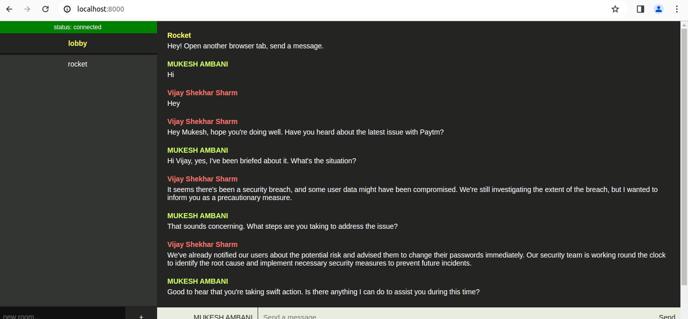
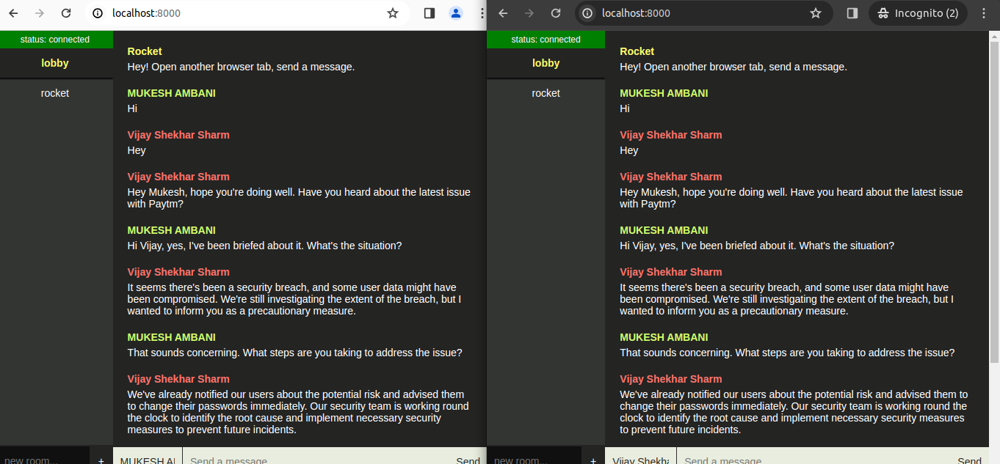

# Chat App in Rust
1. This is a simple chat application built using Rocket rust web framework. It allows users to communicate in real-time via text messages.
# Features
1. Real-time messaging
2. Chat-room creation
# Installation
1. Clone the repository
2. Navigate to the project directory : cd chat-app
3. Install dependency: cargo add rocket --features json cargo add rand
4. start the server : cargo run
5. Open your web browser and go to http://localhost:8000
6. Open a new incognito window and go to http://localhost:8000
# Technologies Used
1. Rocket Web framework
2. HTML
3. CSS
4. Javascript
# Usage
1. Open your web browser and go to http://localhost:8000   
2. Open a new incognito window and go to http://localhost:8000 
3. Enter the guest name and type a message to send.
4. Enter the room name to create a new room.
5. Enter the same room name to join a existing room.
# Screenshots
1. 

2. 

